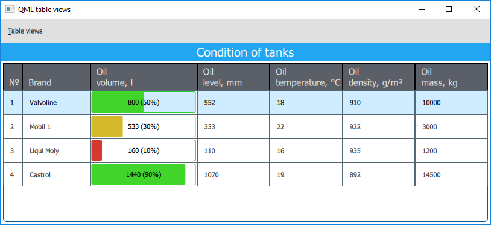
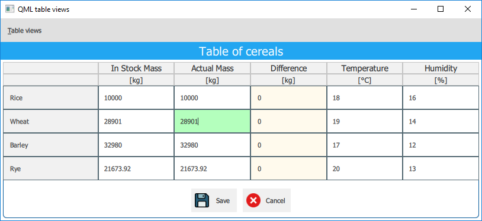

# qml-table-views
Displaying tables using QML

The application demonstrates two variants of tables. The first table does not allow editing data, the second one does.

The application is written in **Qt 5.14.2** using **QML**.

